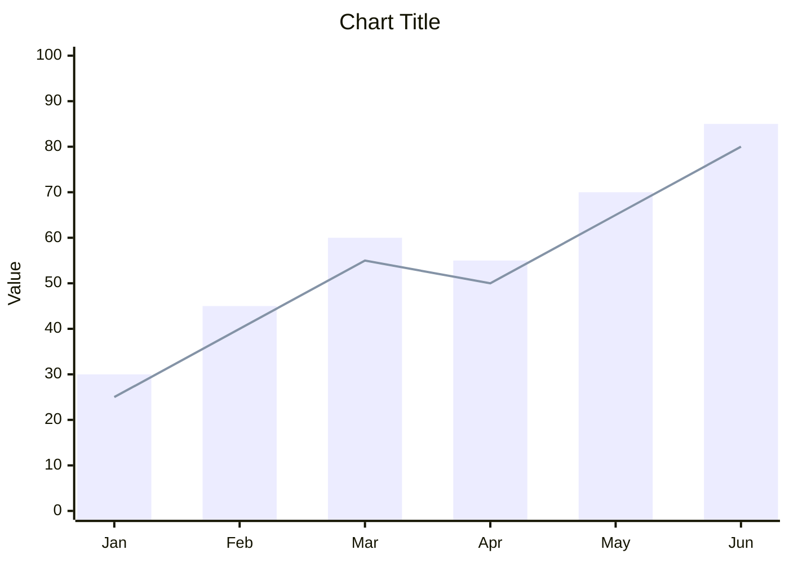

# {{title}}

```mermaid {scale: 0.9}
xychart-beta
    title "Chart Title"
    x-axis [Jan, Feb, Mar, Apr, May, Jun]
    y-axis "Value" 0 --> 100
    bar [30, 45, 60, 55, 70, 85]
    line [25, 40, 55, 50, 65, 80]
```

**Interpretation:** Brief explanation of what the data shows and its significance.

Source: Citation or data source

