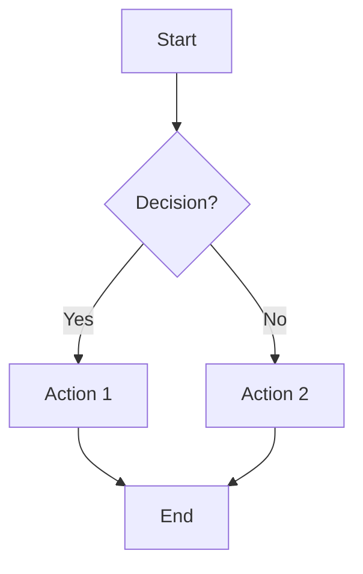
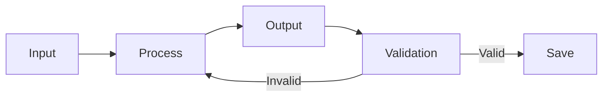
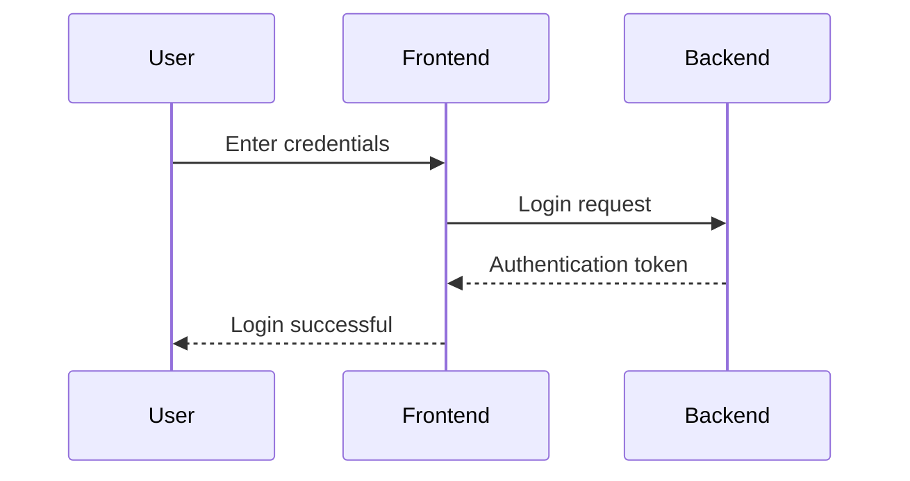
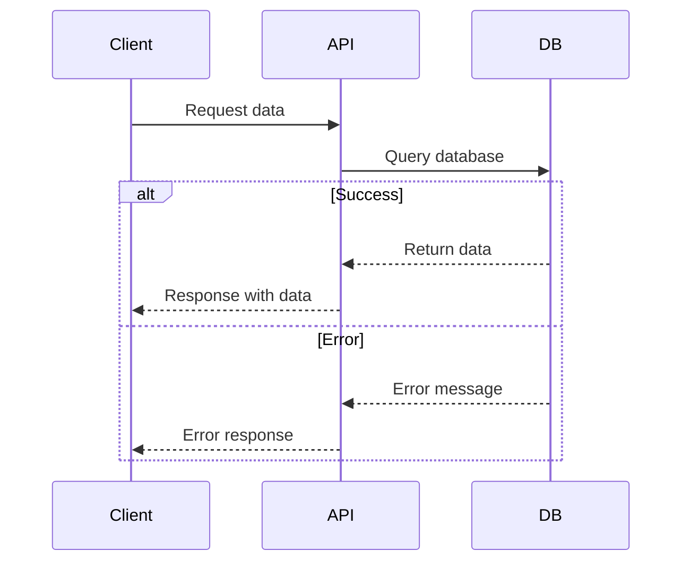
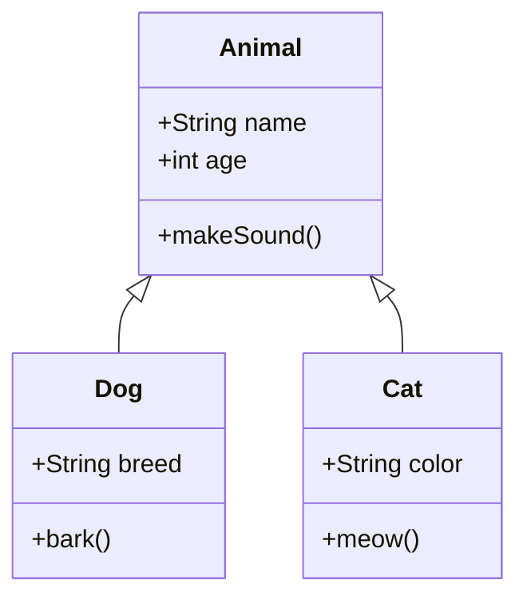
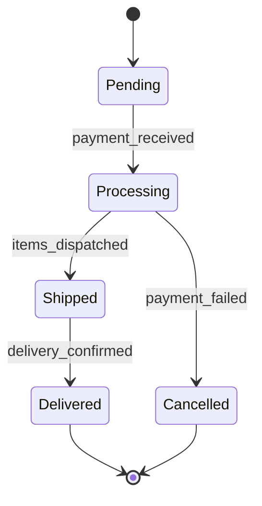

The user may ask you to generate mermaid diagrams. This is a detailed explanation on how to create these diagrams.

## Instructions

Generate valid Mermaid code only. Use the requested diagram type. Reflect the described structure with correct syntax, labels, and links. Do not include explanations or markdown unless requested.

## Input Requirements

- Description: Natural language description of the diagram
- Diagram Type: One of: flowchart, sequence, class, state, er, gantt

## Output Requirement

- Valid Mermaid diagram code only
- You save diagrams .mmd files
- You can use the mermaid CLI to validate if code is valid: mmdc -i <input_file.mmd> -o <output_file.svg_or_png>

## Examples

### Example 1

Description: Simple decision flowchart with start, decision, actions, and end
Type: flowchart
Mermaid Code:

### Example 2

Description: Left-to-right flowchart showing a simple process flow
Type: flowchart
Mermaid Code:

### Example 3

Description: User authentication sequence diagram showing interactions between user, frontend, and backend
Type: sequence
Mermaid Code:

### Example 4

Description: API call sequence with error handling
Type: sequence
Mermaid Code:

### Example 5

Description: Object-oriented class diagram showing inheritance and relationships
Type: class
Mermaid Code:

### Example 6

Description: State machine for a simple order processing system
Type: state
Mermaid Code:

